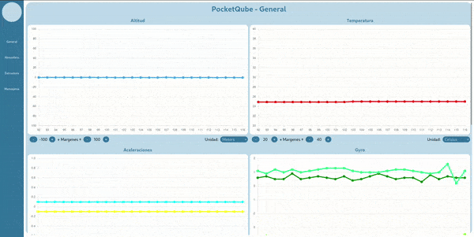

# Luis Meza ☕
Hi! I am a FullStack Web Developer, I like to build things for the browser and/or server.
#### Technologies that I use

  
   

# Portfolio
| **Chart panel** | **Project 2** |
|---------------|---------------|
|  |  |
| Project made with Django, Html, CSS, Javascript and Charts.js | Description for Project 2 |

| **Project 3** | **Project 4** |
|---------------|---------------|
|  |  |
| Description for Project 3 | Description for Project 4 |
