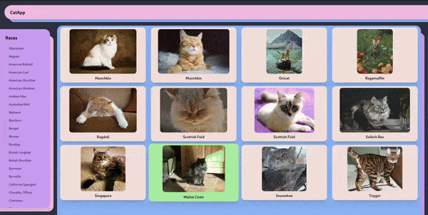
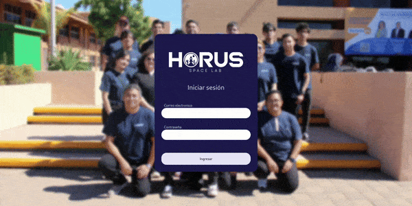
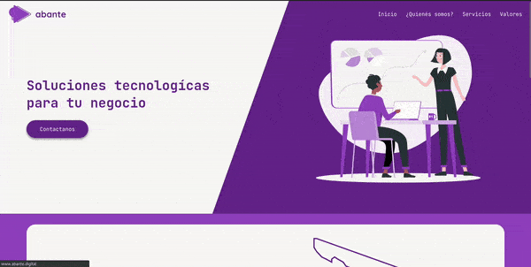

# Luis Meza ☕
Hi! I am a FullStack Web Developer, I like to build things for the browser and/or server.
#### Technologies that I use:

  

# Portfolio
|  |  |
|---------------|---------------|
|  |  |
| Aplication made with the library Chart.js | Aplication for look at photos of difference breeds of cats.

|  | <a href='https://abante.digital'>Landing page.</a> |
|---------------|---------------|
|  |  |
| Description for Project 3 | Description for Project 4 |
